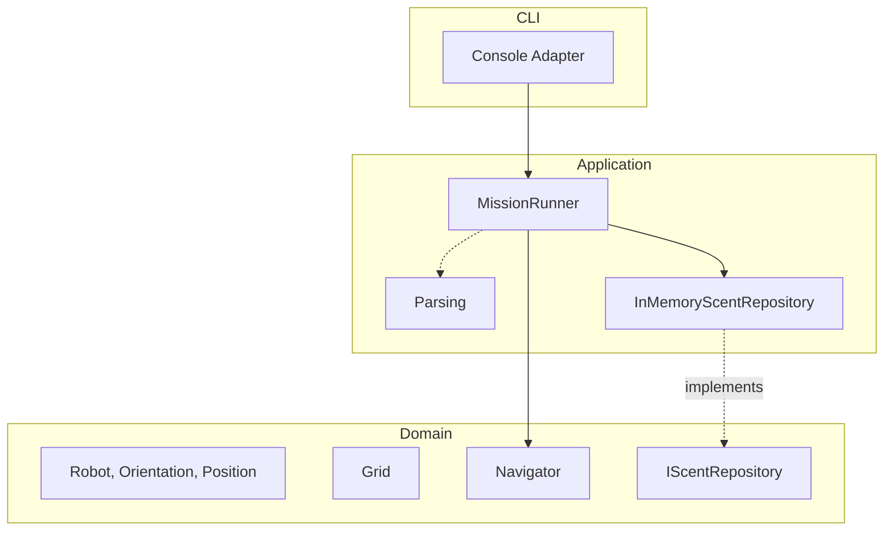

# Martian Robots — Multilingual Reference Solutions

This repository contains working solutions to the Martian Robots programming challenge across many languages. It provides both minimal “Keep It Simple (KISS)” versions and more structured Domain‑Driven Design (DDD) examples, all runnable in Docker and verified by a common harness.

- Problem statement: see `CHALLENGE.md` (adapted from Red Badger Coding Challenge 2018).
- Golden I/O: sample input in `samples/sample-input.txt`, expected output in `goldens/sample-output.txt`.

## Implementations

Naming convention:

- `*-martian-kiss`: minimal, single‑file or tiny program per language (straightforward parsing + simulation).
- `*-martian-ddd`: layered DDD examples (Domain, Application, CLI) to demonstrate richer architecture.

Use `make list` to see what’s available. A few examples:

- `python-martian-kiss`, `python-martian-ddd`
- `csharp-martian-kiss`, `csharp-martian-ddd`
- `go-martian-kiss`, `go-martian-ddd`
- `rust-martian-kiss`, `rust-martian-ddd`
- `node-martian-kiss`, `node-martian-ddd`
- `ts-deno-martian-kiss`, `ts-deno-martian-ddd`
- `java-martian-kiss`, `java-martian-ddd`
- `ocaml-martian-kiss`, `ocaml-martian-ddd`

Each folder includes a `Dockerfile` and a small README with language‑specific notes.

## Quick Start

Prerequisites:

- Docker installed and available on your PATH
- Bash/Make (GNU Make 4.x)

Useful commands:

- Run the full harness across all implementations (all fixtures)

  ```bash
  ./tools/harness.sh
  # or
  make test-all
  ```

- List detected implementations

  ```bash
  make list
  ```

- Test a single implementation by folder name

  ```bash
  LANGS="python-martian-ddd" ./tools/harness.sh
  # or via Make’s generated targets
  make test-python-martian-ddd
  ```

- Build images for everything (without running)
  ```bash
  make build-all
  ```

## Run One Implementation Manually (Example)

Every implementation reads STDIN and writes to STDOUT (no prompts). Images are tagged as `martian:<folder-name>`.

Example with Python (DDD):

```bash
docker build -f python-martian-ddd/Dockerfile -t martian:python-martian-ddd .
cat samples/sample-input.txt | docker run --rm -i martian:python-martian-ddd
```

Example with C# (.NET, KISS wrapper around the reference CLI):

```bash
docker build -f csharp-martian-kiss/Dockerfile -t martian:csharp-martian-kiss .
cat samples/sample-input.txt | docker run --rm -i martian:csharp-martian-kiss
```

For local (non‑Docker) runs, see each language folder’s README.

## How The Harness Works

`tools/harness.sh` will:

- Discover folders matching `*-martian*` at repo root
- Build each image using its `Dockerfile`
- For each `samples/*-input.txt`, pipe into the container and compare against `goldens/*-output.txt`
- Normalize line endings and trailing blanks on both actual and expected

Tip: The expected output includes a trailing blank line; implementations are written to match it exactly.

## Common Assumptions & Gaps

- Input tolerant: trims blank lines; ignores non-L/R/F characters in instruction lines.
- No hard enforcement of limits from CHALLENGE.md (≤50 coords, ≤100 instructions).
- Grid upper-right bound is inclusive; scents are keyed by (position, orientation).
- Minimal error handling; invalid tokens may fail fast or be ignored depending on language.
- Single sample exercised in CI; not exhaustive.

## Areas for Improvement

- Strict input validation and clear errors per spec (bounds, tokens, lengths).
- Additional fixtures and property/fuzz tests across languages.
- Optional CLI flags (e.g., `--strict`, `--no-trim`) and multi-file support.
- Package/publish some versions (crates.io, PyPI, npm) and slim Docker images.
- Benchmark and document complexity; add docs on extending with new commands.

## Adding Another Language

1. Create a folder named like `<lang>-martian-kiss` (or `-ddd`).
2. Add a `Dockerfile` that produces an executable reading from STDIN and writing to STDOUT.
3. Ensure output exactly matches `goldens/sample-output.txt` for `samples/sample-input.txt`.
4. Add a short README with Docker build/run instructions.
5. Run `./tools/harness.sh` to verify.

## References

- Challenge description: `CHALLENGE.md`
- Original background: `csharp-martian-kiss/MartianRobot/README.md`

## DDD Overview

High‑level flow:

```mermaid
flowchart LR
  Input[/STDIN lines/] --> Parser[Application: Parsing]
  Parser --> Mission[Application: Mission Runner]
  Mission --> Nav[Domain: Navigator]
  Nav --> Robot[Domain: Robot]
  Nav --> Grid[Domain: Grid]
  Nav --> Scents[(Domain Port: IScentRepository)]
  Robot -->|state| Mission
  Mission --> Output[\\n STDOUT lines]
```

Layering and dependencies:



Folder mapping (examples):

- C#: `csharp-martian-ddd/src/MartianDDD.{Domain|Application|Cli}`
- Python: `python-martian-ddd/src/martian_ddd/{domain|application|cli}`
- Go: `go-martian-ddd/internal/{domain,app}` and `go-martian-ddd/cmd/martian`
- Rust: `rust-martian-ddd/martian-robot-ddd/src/{domain,application}` with `src/main.rs`
- Node: `node-martian-ddd/src/{domain,app}` with `src/cli.js`
- TS (Deno): `ts-deno-martian-ddd/src/*` (`domain.ts`, `app.ts`, `cli.ts`)
- Java: `java-martian-ddd/src/*` (flat sources for brevity)
- OCaml: `ocaml-martian-ddd/*` modules (`orientation.ml`, `robot.ml`, etc.)
